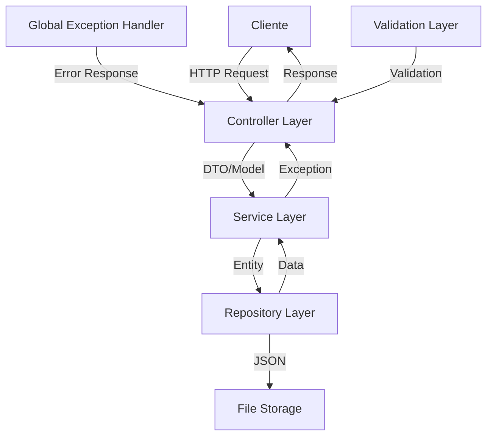
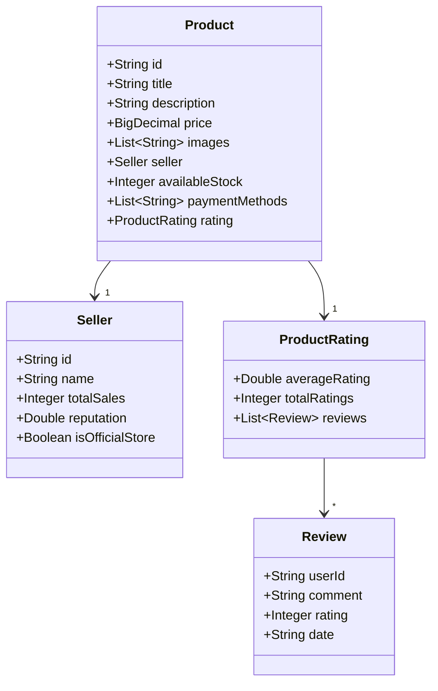

# Documento de Diseño Técnico - API de Productos

## 1. Arquitectura

### 1.1 Visión General
La aplicación sigue una arquitectura en capas tradicional de Spring Boot, con separación clara de responsabilidades:

```
[Cliente] → [Controller] → [Service] → [Repository] → [Almacenamiento JSON]
```

### 1.2 Diagrama de Arquitectura



### 1.3 Modelo de Datos



## 2. Decisiones de Diseño

### 2.1 Tecnologías Seleccionadas

1. **Spring Boot 3.2.3**
   - Framework maduro y robusto
   - Excelente soporte para REST APIs
   - Configuración automática
   - Amplio ecosistema de bibliotecas

2. **Almacenamiento JSON**
   - Simple y portable
   - No requiere configuración de base de datos
   - Suficiente para un prototipo
   - Fácil de migrar a una base de datos real

3. **OpenAPI/Swagger**
   - Documentación interactiva
   - Facilita las pruebas
   - Generación automática de documentación

4. **JaCoCo**
   - Cobertura de código
   - Integración con Maven
   - Reportes detallados

### 2.2 Patrones de Diseño Utilizados

1. **MVC (Model-View-Controller)**
   - Separación clara de responsabilidades
   - Facilita el mantenimiento
   - Estructura probada y conocida

2. **Repository Pattern**
   - Abstracción del almacenamiento de datos
   - Facilita cambios en la implementación
   - Mejora la testeabilidad

3. **Dependency Injection**
   - Acoplamiento débil
   - Facilita las pruebas unitarias
   - Gestión del ciclo de vida de los componentes

### 2.3 Manejo de Errores

1. **Global Exception Handler**
   - Manejo centralizado de excepciones
   - Respuestas consistentes
   - Facilita el mantenimiento

2. **Validación de Datos**
   - Validaciones a nivel de modelo
   - Mensajes de error en español
   - Prevención de datos inválidos

## 3. Desafíos y Soluciones

### 3.1 Persistencia de Datos
**Desafío**: Implementar almacenamiento sin base de datos.
**Solución**: Uso de archivos JSON con sincronización manual y manejo de concurrencia.

### 3.2 Rendimiento
**Desafío**: Mantener buena respuesta con archivo JSON.
**Solución**: 
- Carga en memoria al inicio
- Implementación futura de caché
- Paginación para grandes conjuntos de datos

### 3.3 Pruebas
**Desafío**: Alcanzar alta cobertura de código.
**Solución**:
- Tests unitarios con Mockito
- Tests de integración con MockMvc
- Pruebas de rendimiento planificadas

## 4. Áreas de Mejora

### 4.1 Corto Plazo
- Implementar paginación
- Agregar búsqueda y filtros
- Mejorar validaciones

### 4.2 Mediano Plazo
- Migrar a base de datos real
- Implementar caché
- Agregar autenticación

### 4.3 Largo Plazo
- Escalabilidad horizontal
- Monitoreo y métricas
- CI/CD completo 